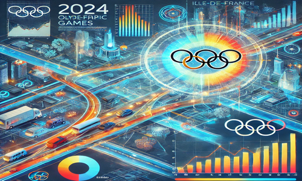

# Synthèse Datavisualisation Jeux Olympiques 2024

## Project Overview

This project aims to leverage data visualization techniques to address the challenges associated with managing transportation infrastructures in Île-de-France during the 2024 Olympic and Paralympic Games. It highlights traffic density, peak hours, and sustainable mobility solutions, providing actionable insights for citizens, visitors, and public transport operators.

---

## Features

### Objectives

- Identify high-traffic zones and peak hours.
- Assist in planning travel for residents and visitors.
- Support public transport operators in decision-making.
- Promote sustainable mobility solutions.

### Visualizations and Functionalities

1. **Travel Time and Distance Analysis**

   - Donut charts created with D3.js to visualize:
     - Travel hours.
     - Total kilometers traveled.
   - Interactive hover effects showing percentages and values for categories like bikes, walking, and buses.

2. **Interactive Map**

   - Built with Leaflet, using GeoJSON data to display congestion levels dynamically.

3. **Dynamic Charts**

   - Bar and line charts with advanced features:
     - Zoom/brush for focusing on specific data ranges.
     - Toggle between bar and line charts.
     - Editable JSON data with real-time updates.
     - Export functionality to save graphs as PNG or JPEG.

4. **Transport Saturation Analysis**

   - Heatmaps created with D3.js to visualize transport saturation in Île-de-France.
   - Sliders and brush zones for temporal filtering.

5. **Navigation and Responsive Design**
   - Centralized navigation via `nav.html`.
   - Unified user experience through consistent UI elements.

---

## Technologies

### Libraries and Frameworks

- **Bootstrap 5**: Responsive design.
- **D3.js**: Interactive and animated visualizations.
- **Leaflet**: Interactive maps with GeoJSON data.

### Data Sources

- GeoJSON files for geographic data.
- Dynamic JSON files for transport modes and congestion levels.

### Advanced Features

- Real-time JSON data editing and chart updates.
- Zoom and brush functionalities.
- Export capabilities to PNG/JPEG.

---

## Image Preview



---

## How to Use

1. Clone the repository:
   ```bash
   git clone https://github.com/your-repo/datavisualization-jo2024.git
   ```
2. Open `index.html` in your browser to explore the visualizations.
3. Navigate through different sections using the top navigation bar.

---

## Summary

This project demonstrates the power of data visualization for large-scale events like the 2024 Olympics. It uses tools such as D3.js and Leaflet to create interactive charts, maps, and real-time data editing functionalities, aiming to enhance mobility and inform decision-making for a wide range of stakeholders.
